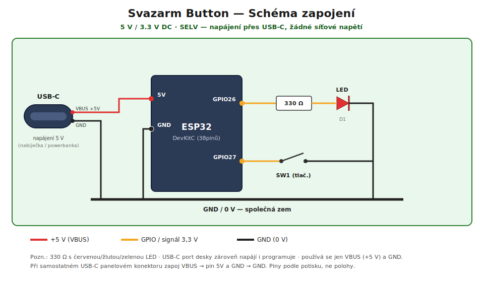

# Návod k zapojení — Svazarm Button

*(English version: [WIRING.md](WIRING.md). Oba dokumenty se musí udržovat v synchronizaci.)*

Kompletní návod ke stavbě hardwaru tlačítka Svazarm. Zařízení je napájené přes
**USB-C** (5 V) — **nikde není síťové napětí**. Vše je nízkonapěťové DC (SELV):
5 V na napájecí větvi, logika 3,3 V.

> ⚠️ **Logika 3,3 V, NENÍ tolerantní k 5 V.** Nikdy nepřiváděj 5 V na žádný GPIO,
> pin `3V3` ani `EN`. 5 V patří jen na pin `5V`/`VIN` (nebo na USB konektor). Jinak
> hrozí trvalé poškození ESP32.

---

## 1. Seznam součástek (BOM)

| # | Součástka | Specifikace | Poznámky |
|---|-----------|-------------|----------|
| 1 | ESP32 DevKitC | 38pinů, ESP-WROOM-32, **USB-C** | Řídicí deska (přes USB-C port se napájí i programuje) |
| 2 | Mikrospínač / tlačítko | SPST-NO, normálně rozepnuté | Libovolné tlačítko (DC, <1 mA — bez nároků na zatížitelnost) |
| 3 | LED | 3/5 mm, **doporučeně červená / žlutá / zelená** | Signalizace (viz §5) |
| 4 | Rezistor k LED | **330 Ω**, ¼ W, ±5 % | Omezení proudu (viz §5) |
| 5 | Zdroj USB-C | 5 V, ≥ 500 mA (nabíječka / powerbanka) | ESP32 + WiFi špička ~250–500 mA |
| 6 | USB-C kabel | datový (pro flashování) | Nabíjecí-only kabel napájí, ale neprogramuje |
| 7 | Rezistor — pull-up tlačítka (volitelné) | 10 kΩ, ¼ W | Jen pro dlouhé vedení k tlačítku |
| 8 | Kondenzátor — debounce (volitelné) | 100 nF keramický | HW debounce pro dlouhé/rušené vedení |
| 9 | USB-C panelový konektor + vodič (volitelné) | breakout s VBUS + GND | Jen pokud chceš USB-C zdířku v krabičce napájející piny `5V`/`GND` |
| 10 | Propojovací vodič | 0,25–0,5 mm² (AWG 22–24) | Lankový pro ohebnost |
| 11 | Krabička | Libovolná malá | Volitelná; žádná síť, takže není bezpečnostně kritická |

Průměrný odběr je malý — firmware podtaktuje CPU na 80 MHz a používá WiFi modem
sleep, takže ustálený stav je zhruba **40–80 mA** s krátkými špičkami při vysílání.
Jakýkoli zdroj 5 V / 1 A přes USB-C bohatě stačí.

---

## 2. Použité piny

Použité jsou jen čtyři piny desky (tlačítko a LED). Napájení přichází přes **USB-C**
konektor desky. **Řiď se popiskami na potisku**, ne fyzickou polohou — pořadí pinů
se mezi revizemi desek liší.

| Pin desky | Směr | Připojení k | Účel |
|-----------|------|-------------|------|
| `GPIO27` | Vstup (pull-up) | Tlačítko noha A | Čte tlačítko (aktivní v LOW) |
| `GPIO26` | Výstup | Anoda LED přes 330 Ω | Budí signalizační LED (aktivní v HIGH) |
| `GND` | — | Tlačítko noha B **a** katoda LED | Společná reference 0 V |
| `5V` (`VIN`) | Napájení | (interně z USB-C) — nebo VBUS z USB-C panelového konektoru | Napájecí větev 5 V |

Referenčně (nezapojeno): `3V3` je regulovaný **výstup** 3,3 V z LDO na desce; `EN`
je reset (dvojí stisk do 3 s smaže WiFi — §9).

---

## 3. Celkové schéma



Barevné schéma výše je celá stavba v jednom obrázku. Níže je textová verze pro
zobrazení v terminálu / v diffu:

```
   ┌──────────── 5 V / 3.3 V DC — SELV (napájeno z USB-C, žádná síť) ─────────┐
   │                                                                         │
   │   USB-C ──VBUS(+5V)──────────────┐                                      │
   │   5V in                          ├── ESP32 5V                           │
   │         ──GND──────────┐         │                                      │
   │                        │     ESP32 GPIO26 ──[ R1 330Ω ]──►|──┐  LED     │
   │                        │         │                            │          │
   │                        │     ESP32 GPIO27 ─────○ ○────────────┤  SW1     │
   │                        │         │              (tlač.)       │          │
   │                        └─── ESP32 GND ──────────── GND ───────┴── 0 V    │
   └─────────────────────────────────────────────────────────────────────────┘

   Legenda:  ──►|──  LED (šipka = anoda → katoda)
             ──○ ○── normálně rozepnutý kontakt tlačítka   [ R ] rezistor
```

### Shrnutí

- **Napájení:** USB-C port desky dodává 5 V interně na větev `5V` a `GND`. (Pokud
  osadíš samostatný USB-C panelový konektor, zapoj jeho **VBUS → `5V`** a
  **GND → `GND`**; používají se jen tyto dva piny.)
- **LED:** `GPIO26` v HIGH → proud teče `GPIO26 → R1 → LED → GND`.
- **Tlačítko:** `GPIO27` je v klidu v HIGH díky internímu pull-upu; stiskem `SW1`
  se stáhne na `GND` (LOW) — to je „stisk".

---

## 4. Obvod LED a volba rezistoru

```
   GPIO26 ──[ R1 ]──►|── GND
                     LED
                (anoda)(katoda)
```

Sériový rezistor navrhni podle:

```
        Vgpio − Vf
  R  =  ──────────      Vgpio = 3,3 V (GPIO v HIGH),  Vf = úbytek na LED,
            I           I = cílový proud (5–10 mA bohatě stačí)
```

| Barva LED | Typ. Vf | R pro ~6 mA | Použij | Hodnocení |
|-----------|---------|-------------|--------|-----------|
| Červená | 1,8–2,0 V | ≈ 233 Ω | **220–330 Ω** | Jasná, ideální |
| Žlutá / oranžová | 2,0–2,2 V | ≈ 200 Ω | **220–330 Ω** | Jasná |
| Zelená (běžná) | 2,0–2,2 V | ≈ 200 Ω | **220–330 Ω** | Jasná |
| Modrá / bílá / „čistě zelená" | 2,8–3,4 V | hraniční | 100–150 Ω | Slabá/nespolehlivá — **nepoužívat** |

**Použij 330 Ω s červenou/žlutou/zelenou LED** (~4–5 mA — dobře viditelné, hluboko
pod limitem GPIO ESP32, doporučeno ≤ 20 mA). **Anoda (delší noha, +)** směrem k
rezistoru/`GPIO26`; **katoda (kratší noha, ploška, −)** na `GND`. Obráceně zapojená
LED prostě nesvítí. Rezistor může být na kterékoli straně LED.

---

## 5. Obvod tlačítka

```
   GPIO27 ─────────────┬───────────○ ○───────── GND
                       │           (SW1, NO)
            (volitelné)│
            R2 10kΩ ───┤  na 3V3   (extra pull-up, většinou zbytečný)
                       │
            (volitelné)│
            C1 100nF ──┴───────────────────────── GND   (debounce)
```

- **Základ (doporučeno):** jen tlačítko mezi `GPIO27` a `GND`. Firmware zapíná
  `INPUT_PULLUP` (~45 kΩ) a v softwaru dělá debounce ~50 ms — žádné externí
  součástky netřeba.
- **Dlouhé vedení (> ~30 cm) / rušené prostředí:** přidej **C1 (100 nF)** z `GPIO27`
  na `GND` u desky, volitelně **R2 (10 kΩ)** na `3V3`.
- Tlačítko není polarizované — kteroukoli nohu lze dát na `GPIO27` nebo `GND`.

---

## 6. Napájení a programování (USB-C)

- **Napájení i programování jedním portem:** zapoj **datový USB-C kabel** do USB-C
  konektoru desky. LDO na desce vytvoří z 5 V VBUS 3,3 V. Použij `make flash` /
  `make monitor` přes toto spojení.
- **Nabíjecí-only kabel** desku napájí, ale neumí nahrát firmware — k flashování
  použij pořádný datový kabel.
- **Trvalá instalace:** funguje jakákoli USB-C nabíječka 5 V nebo powerbanka.
  Volitelně osaď do krabičky **USB-C panelový konektor** a zapoj jeho
  **VBUS → `5V`** a **GND → `GND`** (pro napájení stačí jen tyto dva vodiče).
- Uzemnění: USB-C `GND`, ESP32 `GND`, katoda LED a tlačítko sdílejí jeden společný
  uzel 0 V.

---

## 7. Postup montáže

1. **LED:** urči anodu (delší noha) a katodu (kratší noha / ploška). Zapoj `R1`
   (330 Ω) sériově s anodou. Volný konec `R1` → `GPIO26`, katoda → `GND`.
2. **Tlačítko:** jedna noha → `GPIO27`, druhá → `GND` (volitelně `C1`/`R2` dle §5).
3. **Napájení:** zapoj USB-C kabel, nebo osaď volitelný panelový konektor
   (`VBUS → 5V`, `GND → GND`).
4. **Zkontroluj** dle §3 — polarita LED, žádných 5 V na GPIO.
5. **První zapnutí:** deska naběhne, vypisuje na sériovou linku 115200, a pokud
   nenajde známou WiFi, otevře AP `SvazarmButton-Setup` pro konfiguraci.

---

## 8. Ověření (multimetr + sériová linka)

| Kontrola | Jak | Očekávání |
|----------|-----|-----------|
| Napájecí větev | DC napětí `5V` ↔ `GND`, pod napětím | ~4,7–5,2 V |
| Logická hladina | DC napětí `3V3` ↔ `GND`, pod napětím | ~3,2–3,3 V |
| Tlačítko puštěné | DC napětí `GPIO27` ↔ `GND`, klid | ~3,3 V (interní pull-up) |
| Tlačítko stisknuté | totéž, držet tlačítko | ~0 V |
| Buzení LED | DC napětí `GPIO26` ↔ `GND` během 10× bliknutí | přepíná 0 V / ~3,3 V |

Na sériové lince (`make monitor`, 115200) bys měl vidět úvodní hlášku,
`CPU frequency: 80 MHz`, výsledek připojení WiFi a po každém přijatém stisku řádek
`POST … -> 204 (OK)` následovaný 10× bliknutím LED.

---

## 9. Provozní poznámky a upozornění k pinům

- **Aktivní úrovně:** tlačítko je **aktivní v LOW** (stisk = 0 V); LED je **aktivní
  v HIGH** (`GPIO26` v HIGH = svítí). Při obráceném zapojení LED (`GPIO26 → katoda`,
  anoda → `3V3`) je nutné invertovat `ledSet()` v `src.ino`.
- **Vyhni se strapping pinům** pro tlačítko/LED: `GPIO0/2/5/12/15`. `GPIO26`/`GPIO27`
  (zde použité) jsou bezpečné univerzální piny.
- **Pouze vstupní piny** (`GPIO34/35/36/39`) neumí budit LED a nemají interní
  pull-up — zde je nepoužívej.
- **Double-reset:** stiskni tlačítko **EN/RST** na desce dvakrát do 3 s pro smazání
  uložené WiFi a znovuotevření konfiguračního portálu.
- **Konfigurační portál na vyžádání:** podrž **tlačítko** při zapnutí (~3 s, dokud
  LED dvakrát neblikne) pro úpravu Backend URL / Auth tokenu / cooldownu bez ztráty
  WiFi (viz README).
