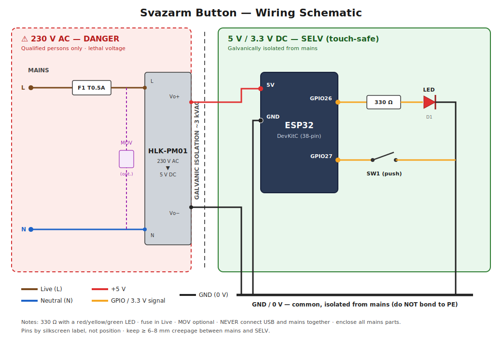

# Wiring Guide — Svazarm Button

*(Česká verze: [WIRING.cs.md](WIRING.cs.md). Both documents must be kept in sync.)*

A full build guide for the Svazarm Button hardware. The device is mains-powered
through an **HLK-PM01** AC-DC module (230 V AC → 5 V DC) so it plugs straight into
the wall with **no external power brick**.

> ☠️ **DANGER — 230 V MAINS VOLTAGE INSIDE THIS DEVICE.**
> The HLK-PM01 input side carries lethal mains voltage. **Only a qualified person
> should build or service the mains wiring.** Always work **de-energized**: unplug
> from the wall and verify zero voltage with a tester before touching anything.
> The finished device **must** be inside a closed, insulated enclosure with no
> exposed mains conductors. Never connect USB and mains at the same time (see §6).

The device has **two electrically separate domains**:

- **230 V AC side (dangerous):** mains → fuse → HLK-PM01 input.
- **5 V / 3.3 V DC side (SELV, safe to touch):** HLK-PM01 output → ESP32, button,
  LED. This side is **galvanically isolated** from mains by the HLK-PM01
  (~3 kVAC isolation), which is what makes it SELV.

> ⚠️ **3.3 V logic, NOT 5 V tolerant.** Never put 5 V (or mains!) on any GPIO, the
> `3V3` pin, or `EN`. 5 V belongs only on the `5V`/`VIN` pin.

---

## 1. Bill of Materials

| # | Part | Spec | Notes |
|---|------|------|-------|
| 1 | [HLK-PM01](https://dratek.cz/arduino-platforma/176693-napajeci-zdroj-5vdc-600ma-3w-do-dps.html) | 100–264 V AC in → **5 V DC 600 mA 3 W** out, PCB mount | The mains power supply; isolated output |
| 2 | ESP32 DevKitC | 38-pin, ESP-WROOM-32 | The controller board |
| 3 | Momentary push button | SPST-NO, normally open | Any tactile / panel button (DC, <1 mA — no rating concern) |
| 4 | LED | 3/5 mm, **red / yellow / green preferred** | Feedback indicator (see §5) |
| 5 | Resistor for LED | **330 Ω**, ¼ W, ±5 % | LED current limiting (see §5) |
| 6 | **Fuse + holder** (recommended) | **T 0.5 A**, 250 V, slow-blow | In the Live line, ahead of the HLK-PM01 |
| 7 | MOV / varistor (optional) | 275 VAC (e.g. S14K275) | Surge protection across L–N |
| 8 | Resistor — button pull-up (optional) | 10 kΩ, ¼ W | Only for long button wiring |
| 9 | Capacitor — button debounce (optional) | 100 nF ceramic | Hardware debounce for long/noisy runs |
| 10 | Mains wire | ≥ 0.5 mm² (AWG 20), **mains-rated insulation** | For the L/N runs to the HLK-PM01 |
| 11 | Hook-up wire | 0.25–0.5 mm² | For the 5 V/3.3 V side |
| 12 | Terminal blocks / connectors | Mains-rated | For safe, removable mains connections |
| 13 | **Enclosure** | Closed, insulated (ideally flame-retardant) | **Mandatory** — no exposed mains |

The HLK-PM01 supplies 5 V / 600 mA (3 W). The button draws ~40–80 mA average
(CPU underclocked to 80 MHz + WiFi modem sleep), with short transmit peaks — well
within the module's budget.

---

## 2. Pins Used (DC side)

Only four board pins are used. **Go by the silkscreen labels**, not physical
position — pin order varies between board revisions.

| Board pin | Direction | Connects to | Purpose |
|-----------|-----------|-------------|---------|
| `5V` (`VIN`) | Power in | HLK-PM01 **Vo+** | 5 V from the mains module |
| `GND` | — | HLK-PM01 **Vo−**, button leg B, LED cathode | Common 0 V (DC side) |
| `GPIO27` | Input (pull-up) | Button leg A | Reads the button (active LOW) |
| `GPIO26` | Output | LED anode via 330 Ω | Drives the feedback LED (active HIGH) |

Reference (not wired): `3V3` is the regulated 3.3 V **output** of the board's
on-board LDO; `EN` is reset (double-press within 3 s wipes WiFi — §9).

---

## 3. Full Schematic



The colour-coded schematic above is the complete build in one picture. A
text-only version follows for terminal/diff viewing:

```
   ╔═══════════════ 230 V AC SIDE — DANGEROUS ═══════════════╗
   ║                                                          ║
   ║   Mains L ──[ F1  T0.5A ]──┬───────────── HLK-PM01  "L"  ║
   ║                            │                  (AC in)    ║
   ║                          [MOV]  (optional, L–N)          ║
   ║                            │                             ║
   ║   Mains N ─────────────────┴───────────── HLK-PM01  "N"  ║
   ║                                                          ║
   ║                              HLK-PM01  Vo+ ─┐   Vo− ─┐   ║
   ╚═════════════════════════════════════════════│════════│══╝
                  isolation (~3 kVAC)             │        │
   ╔═══════════════ 5 V / 3.3 V DC SIDE — SELV ═══│════════│══╗
   ║                                              │        │  ║
   ║                              ESP32 DevKitC   │        │  ║
   ║                            ┌─────────────────┴──┐     │  ║
   ║                  5V (VIN) ─┤ 5V                  │     │  ║
   ║                       GND ─┤ GND ────────────────┼─────┘  ║
   ║                            │                     │ (common 0 V)
   ║              GPIO26 ───────┤ GPIO26              │        ║
   ║                            │    └──[ R1 330Ω ]──►|──┐     ║
   ║                            │                LED D1   │     ║
   ║              GPIO27 ───────┤ GPIO27           (a)(k) │     ║
   ║                            │    └────○ ○───┐         │     ║
   ║                            └──────────────────────────────╜
   ║                                 SW1 (push)  │         │   ║
   ║                                             └────GND──┴───╜
   ╚══════════════════════════════════════════════════════════╝

   Legend:  ──►|──  LED (arrow = anode → cathode)
            ──○ ○── momentary normally-open contact
            [ F1 ]  fuse     [ R ] resistor     [MOV] varistor
```

### Domain summary

- **AC side:** `L → F1 fuse → HLK-PM01 "L"`, `N → HLK-PM01 "N"`. Optional MOV across
  L–N for surge clamping. **Nothing else** connects to the AC side.
- **DC side:** `HLK Vo+ → ESP32 5V`, `HLK Vo− → ESP32 GND` (common 0 V). Button and
  LED hang off the GPIOs exactly as before. This whole side is isolated from mains.

---

## 4. Mains Input (HLK-PM01)

```
   L ──[ F1  T0.5A 250V ]──┬────────── HLK-PM01  "AC L"
                           │
                         [ MOV 275VAC ]   (optional)
                           │
   N ──────────────────────┴────────── HLK-PM01  "AC N"

   HLK-PM01  Vo+ ───────────────────── ESP32  5V
   HLK-PM01  Vo− ───────────────────── ESP32  GND
```

- **Fuse F1** goes in the **Live** conductor, *before* the HLK-PM01. A **T 0.5 A /
  250 V** slow-blow is generous for a 3 W supply and protects against module
  failure. Do not omit it on a permanent mains install.
- **MOV (optional)** across L–N clamps mains surges; pick ~275 VAC rating.
- The HLK-PM01 is a **Class II / double-insulated isolated** module — its 5 V
  output is floating and isolated from mains, so **no protective earth (PE) is
  required** on the output. If your mains has a PE conductor, terminate it safely
  (e.g., to an earth terminal); it does **not** connect to the DC 0 V.
- HLK-PM01 input polarity is not critical for function (it's an AC input), but
  **label L and N clearly** and keep the fuse in Live for correct protection.
- The HLK-PM01 is **always live** whenever the device is plugged in — it has no
  switch. There is no standby/off state.

---

## 5. LED Sub-circuit & Resistor Selection (DC side)

```
   GPIO26 ──[ R1 ]──►|── GND
                     LED
                (anode)(cathode)
```

Size the series resistor from:

```
        Vgpio − Vf
  R  =  ──────────      Vgpio = 3.3 V (GPIO HIGH),  Vf = LED forward voltage,
            I           I = target current (5–10 mA is plenty)
```

| LED colour | Typ. Vf | R for ~6 mA | Use | Verdict |
|------------|---------|-------------|-----|---------|
| Red | 1.8–2.0 V | ≈ 233 Ω | **220–330 Ω** | Bright, ideal |
| Yellow / amber | 2.0–2.2 V | ≈ 200 Ω | **220–330 Ω** | Bright |
| Green (standard) | 2.0–2.2 V | ≈ 200 Ω | **220–330 Ω** | Bright |
| Blue / white / "pure green" | 2.8–3.4 V | marginal | 100–150 Ω | Dim/unreliable — **avoid** |

**Use 330 Ω with a red/yellow/green LED** (~4–5 mA — clearly visible, far below the
ESP32 GPIO limit of ≤ 20 mA recommended). **Anode (long leg, +)** toward the
resistor/`GPIO26`; **cathode (short leg, flat side, −)** to `GND`. A reversed LED
just won't light.

---

## 6. Button Sub-circuit (DC side)

```
   GPIO27 ─────────────┬───────────○ ○───────── GND
                       │           (SW1, NO)
            (optional) │
            R2 10kΩ ───┤  to 3V3   (extra pull-up, usually unnecessary)
                       │
            (optional) │
            C1 100nF ──┴───────────────────────── GND   (debounce)
```

- **Baseline:** just the button between `GPIO27` and `GND`. Firmware enables the
  internal pull-up (~45 kΩ) and debounces ~50 ms in software — no external parts
  needed.
- **Long runs (> ~30 cm) / noisy environment:** add **C1 (100 nF)** from `GPIO27`
  to `GND` at the board, optionally **R2 (10 kΩ)** to `3V3`.
- The button is not polarised — either leg to `GPIO27` or `GND`.

---

## 7. Powering & Programming

- **Normal operation:** powered from mains via the HLK-PM01 (§4). The board boots
  as soon as it's plugged in.
- **Programming / bench work:** flash over the board's **USB** connector **with the
  mains UNPLUGGED**.

> ☠️ **Never have USB and mains connected simultaneously.** Both feed the 5 V rail;
> connecting them together can back-feed and damage the HLK-PM01, the USB host, or
> the board. Unplug mains before plugging in USB, and vice-versa.

Grounding on the DC side: HLK `Vo−`, ESP32 `GND`, LED cathode and button all share
one common 0 V node. This 0 V is isolated from mains — do **not** bond it to PE.

---

## 8. Assembly Steps

1. **Power off / unplugged** for all work.
2. **DC side first (safe):**
   - LED: solder `R1` (330 Ω) in series with the anode; free end → `GPIO26`,
     cathode → `GND`.
   - Button: one leg → `GPIO27`, other → `GND` (optional `C1`/`R2` per §6).
   - HLK output: `Vo+` → ESP32 `5V`, `Vo−` → ESP32 `GND`.
3. **AC side (qualified person):**
   - Fit `F1` in the Live line; wire `L (via fuse) → HLK "L"`, `N → HLK "N"`.
   - Optional MOV across L–N. Use mains-rated wire and terminal blocks.
   - Keep mains conductors away from the DC side — maintain **≥ 6–8 mm creepage**
     between mains and SELV (see §10).
4. **Enclose:** mount everything in the closed insulated enclosure with strain
   relief on the mains cable. No exposed mains. Programming USB port should remain
   accessible only with the enclosure open / mains removed.
5. **Inspect** against §3 — LED polarity, fuse in Live, no 5 V/mains on a GPIO,
   adequate creepage — **before** energizing.
6. **First power-up:** unplug USB, plug into mains. The board boots, prints to
   serial at 115200 (only reachable via USB on the bench), and if no known WiFi is
   found it opens the `SvazarmButton-Setup` AP.

---

## 9. Verification

Do mains-side checks **only when de-energized**, or live **only if you are
qualified and using proper instruments**.

| Check | How | Expected |
|-------|-----|----------|
| Fuse present in Live | Visual / continuity, unplugged | F1 in Live, intact |
| Mains↔DC isolation | Megger/insulation test L/N ↔ Vo−, unplugged | Very high (MΩ+) — confirms isolation |
| HLK output | DC volts `Vo+`↔`Vo−`, **mains live, qualified only** | ~4.7–5.2 V |
| Logic rail | DC volts `3V3`↔`GND` | ~3.2–3.3 V |
| Button released / pressed | DC volts `GPIO27`↔`GND` | ~3.3 V idle / ~0 V pressed |
| LED drive | DC volts `GPIO26`↔`GND` during a 10× blink | toggling 0 V / ~3.3 V |

On serial (`make monitor`, 115200, USB on the bench) you should see the boot
banner, `CPU frequency: 80 MHz`, the WiFi result, and on each accepted press a
`POST … -> 204 (OK)` line followed by the 10× LED blink.

---

## 10. Mains Safety & Layout

- **Qualified persons only** for the AC side. If unsure, have an electrician do it.
- **Creepage / clearance:** keep ≥ 6–8 mm between any mains conductor/pad and the
  SELV side. Don't run mains and low-voltage wires through the same hole; separate
  and secure them.
- **Enclosure:** fully closed, insulating (plastic) or properly earthed metal,
  ideally flame-retardant. No part of the mains side touchable from outside.
- **Strain relief** on the mains cable so a tug can't pull conductors loose onto
  the DC side.
- **Fuse in Live**, never in Neutral.
- The HLK-PM01 runs warm — give it a little airflow / spacing; don't bury it in
  insulation.
- **Discharge & verify:** after unplugging, treat the mains side as live until
  verified at 0 V; input filter caps can hold charge briefly.

---

## 11. Operating Notes & Pin Cautions

- **Active levels:** button is **active LOW** (pressed = 0 V); LED is **active
  HIGH** (`GPIO26` HIGH = lit). Wiring the LED inverted (`GPIO26 → cathode`, anode
  → `3V3`) requires inverting `ledSet()` in `src.ino`.
- **Avoid strapping pins** for button/LED: `GPIO0/2/5/12/15`. `GPIO26`/`GPIO27`
  (used here) are safe general-purpose pins.
- **Input-only pins** (`GPIO34/35/36/39`) can't drive an LED and have no internal
  pull-ups — don't use them here.
- **Double-reset:** press the board's **EN/RST** twice within 3 s to clear stored
  WiFi and reopen the captive portal.
- **Config portal on demand:** hold the **push button** during power-up (~3 s,
  until the LED double-blinks) to edit Backend URL / Auth token / cooldown without
  losing WiFi (see the README).
